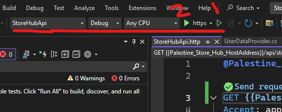

To start testing the backend project:
1- Open StoreHubApi.sln using visual studio 2022.
2- Make sure to have the following selection

3- Click on '1' to run backend service without debugging (Useful for frontend team), or click on '2' for debugging (Useful for the development team)
4- Enter this link to test the APIs https://localhost:7215/swagger/index.html